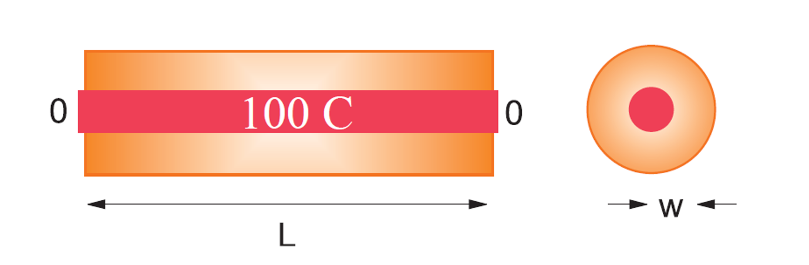

# 项目1：铝棒中的热扩散

## 1. 项目背景与物理意义

热传导是自然界和工程领域中一种基本的热量传递方式。本项目模拟一根长度为 $L=1$ m 的铝棒内的热量扩散过程。铝棒两端保持在 $0$ K（冰水浴），初始时刻铝棒整体温度为 $100$ K。我们需要研究铝棒内部温度 $T(x,t)$ 如何随空间位置 $x$ 和时间 $t$ 演化。

描述此过程的偏微分方程是一维热传导方程：

$$
\frac{\partial T(x,t)}{\partial t} = D \frac{\partial^2 T(x,t)}{\partial x^2}
$$

其中 $D = K/(C\rho)$ 是热扩散系数，$K$ 是热导率，$C$ 是比热容，$\rho$ 是密度。

**物理参数：**
- 铝棒长度: $L = 1$ m
- 初始条件: $T(x, t=0) = 100$ K for $0 < x < L$
- 边界条件: $T(x=0, t) = 0$ K, $T(x=L, t) = 0$ K
- 热导率: $K = 237 \text{ W/(m K)}$
- 比热容: $C = 900 \text{ J/(kg K)}$
- 密度: $\rho = 2700 \text{ kg/m}^3$

## 2. 学习目标

完成本项目后，学生应能：

1.  理解一维热传导方程的物理意义及其数学表达。
2.  掌握使用显式有限差分法 (Explicit Finite Difference Method, FTCS) 求解热传导方程的原理和实现。
3.  能够实现热传导问题的解析解，并将其与数值解进行对比和分析。
4.  理解并验证数值解的稳定性条件，特别是参数 $r = D \Delta t / (\Delta x)^2$ 的影响。
5.  能够根据不同的物理情景（如不同的初始条件、边界条件或增加物理项如牛顿冷却）修改和扩展数值模型。
6.  培养使用 Python (NumPy, Matplotlib) 进行科学计算和数据可视化的能力。

## 3. 项目任务

本项目包含以下几个核心任务，请在 `heat_diffusion_student.py` 文件中完成相应的函数实现。

### 任务1: 基本热传导模拟

-   **要求**：根据给定的物理参数和初始/边界条件，使用显式有限差分法编写程序求解一维热传导方程。选择合适的空间步长 $\Delta x$ 和时间步长 $\Delta t$ (例如，$\Delta x = 0.01$ m, $\Delta t = 0.5$ s，计算并打印 $r$ 值)。模拟足够长的时间（例如，到 $t=1000$ s 或 $N_t=2000$ 个时间步）。
-   **可视化**：绘制温度分布 $T(x,t)$ 的三维表面图。

### 任务2: 解析解

-   **要求**：
    1.  实现热传导方程的解析解。对于本项目给定的初边界条件，解析解为：

        $T(x,t)=\sum\limits_{n=1,3,\cdots}^{\infty}\frac{4T_0}{n\pi}\sin(k_nx)e^{-k_n^2Dt}$

        其中 $k_n = n\pi/L$, $T_0=100$ K。在求和时，取前N项（例如 N=50 或 100）即可得到较好的近似。
    2.  绘制解析解的三维温度分布图。

### 任务3: 数值解的稳定性分析

-   **要求**：研究稳定性参数 $r = D \Delta t / (\Delta x)^2$ 对数值解的影响。
    1.  保持 $\Delta x = 0.01$ m 不变，选择一个 $\Delta t$ 使得 $r > 0.5$ (例如，文档中提示可尝试 $r \approx 0.24$ (dt=0.25s) 和 $r \approx 0.48$ (dt=0.5s)，这里要求 $r > 0.5$，例如取 $\Delta t = 0.6$ s，计算此时的 $r$ 值)。
    2.  使用新的 $\Delta t$ 运行模拟，观察并记录数值解是否出现非物理震荡或发散现象。
    3.  解释观察到的现象，并与稳定性理论 $r \le 0.5$ 联系起来。

### 任务4: 不同初始条件的模拟

-   **要求**：模拟一个物理情景：两根长度各为 $0.5$ m (总长 $L=1$ m) 的铝棒在 $x=0.5$ m 处连接。左边 ($0 \le x < 0.5$ m) 的铝棒初始温度为 $100$ K，右边 ($0.5 \le x \le 1$ m) 的铝棒初始温度为 $50$ K。两端 ( $x=0, x=L$) 仍然保持 $0$ K。
    1.  修改初始条件以反映这种情况。
    2.  使用稳定的参数（例如任务1中的参数）进行模拟。
    3.  绘制温度分布 $T(x,t)$ 的三维图，观察温度如何演化。

### 任务5: 包含牛顿冷却定律的热传导模拟

-   **要求**：考虑铝棒并非处于完美绝热环境中，而是与外部环境（假设环境温度 $T_e=0$ K）发生热交换，遵循牛顿冷却定律。此时，热传导方程变为：
    
$$
\frac{\partial T(x,t)}{\partial t} = D \frac{\partial^2 T(x,t)}{\partial x^2} - h T(x,t)
$$

其中 $h$ 是一个正常数，代表冷却系数 (例如，取 $h=0.01 \text{ s}^{-1}$ 或 $h=0.1 \text{ s}^{-1}$，注意单位)。
1.  修改显式差分法的迭代公式以包含牛顿冷却项。
    提示： $T_i^{j+1} = (1-2r-h\Delta t)T_i^j + r(T_{i+1}^j + T_{i-1}^j)$
2.  使用与任务1相同的初始条件、边界条件和稳定的时间空间步长进行模拟。
3.  绘制包含牛顿冷却时的三维温度分布图，并与任务1（绝热情况）的结果进行定性比较。

## 4. 提示与资源

-   参考《计算物理基础》关于偏微分方程数值解法，特别是热传导方程和显式差分法的内容。
-   注意数值计算中的浮点数精度问题。
-   对于三维绘图，可以使用 `mpl_toolkits.mplot3d`。

## 5. 提交要求

1.  完成 `heat_diffusion_student.py` 中所有 `TODO` 标记的函数实现。
2.  确保你的代码可以正确运行并通过 `tests/test_heat_diffusion.py` 中的基本测试用例。
3.  撰写实验报告 (`实验报告模板.md`)，包括：
    *   每个任务的简要算法描述。
    *   关键代码片段。
    *   主要的结果图表
    *   对结果的分析和讨论，特别是关于稳定性、不同初始条件和牛顿冷却的影响。
    *   遇到的问题及解决方法，以及实验收获。

